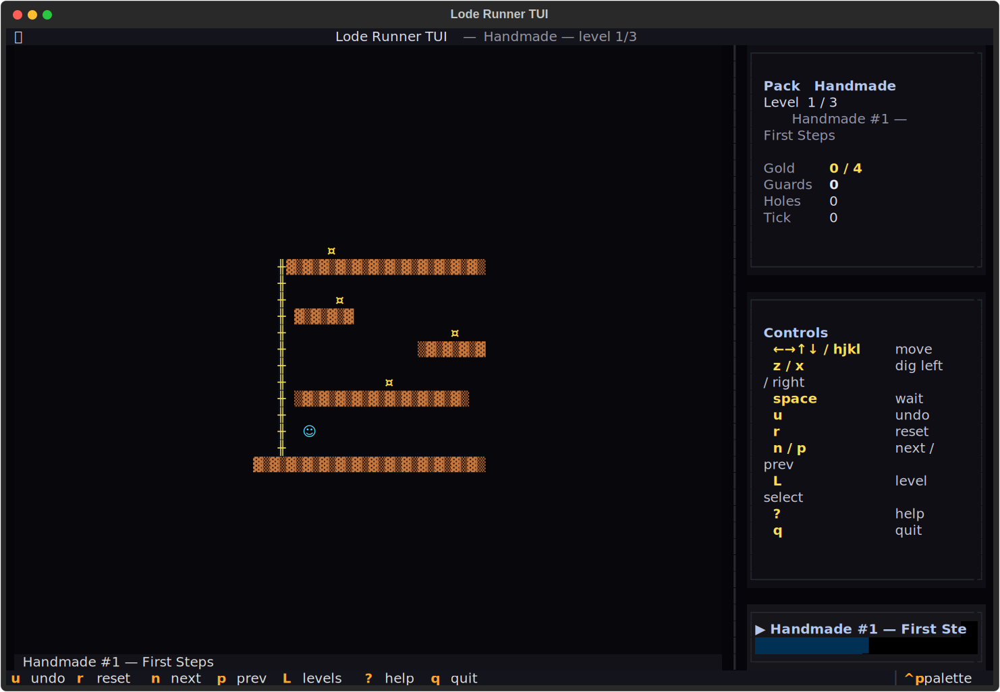
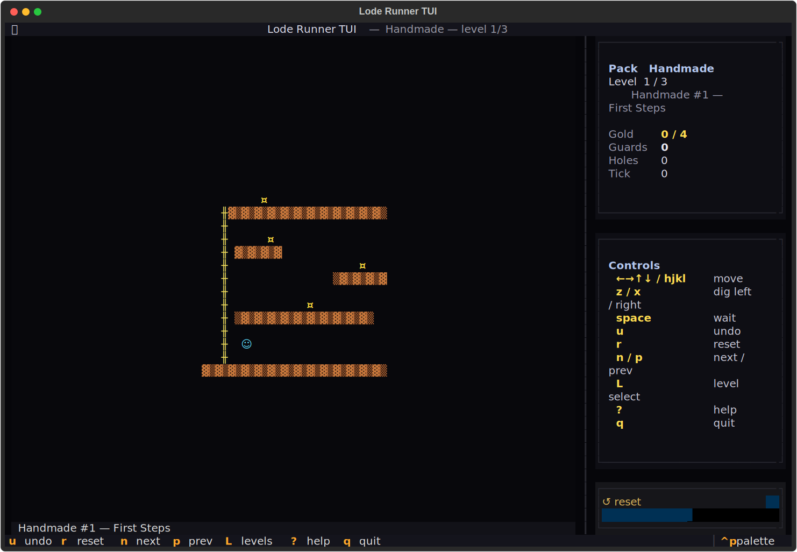
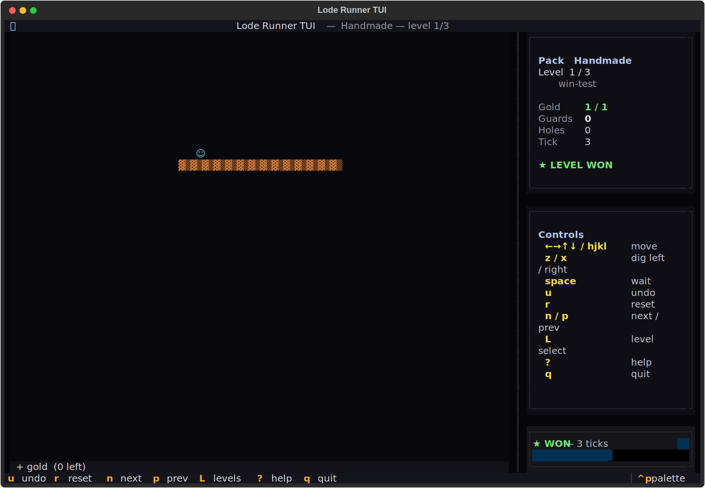

# goldcarver-tui
Dig the trap. Take the gold.





## About
Three hundred and seventy-one levels. Five packs. Dig a hole, trap a guard, grab the gold, climb the ladder to the top. Guards pursue via BFS now — they're smarter than you remember. The original dig-and-climb platformer, in faithful terminal tile-form.

## Screenshots


## Install & Run
```bash
git clone https://github.com/akakabrian/goldcarver-tui
cd goldcarver-tui
make
make run
```

## Controls
<Add controls info from code or existing README>

## Testing
```bash
make test       # QA harness
make playtest   # scripted critical-path run
make perf       # performance baseline
```

## License
MIT

## Built with
- [Textual](https://textual.textualize.io/) — the TUI framework
- [tui-game-build](https://github.com/akakabrian/tui-foundry) — shared build process
